# Schémas fonctionnel, d'architecture et séquences du dashboard

> Généré à partir du code réel de `agent/backend/` et `frontend/src/`, et vérifié en conditions
> réelles : les 10 actions du dashboard ont été exercées par un navigateur piloté (Playwright) contre
> la stack complète (4 APIs + 4 serveurs MCP + backend), sans aucune option en échec.
>
> Une version illustrée (palette de marque, navigation, légende) est publiée en Artifact — demander le
> lien si besoin. Ce document est la version versionnée avec le code, qui reste à jour à chaque évolution.

## Sommaire

1. [Schéma fonctionnel](#schéma-fonctionnel)
2. [Schéma d'architecture](#schéma-darchitecture)
3. [Authentification](#1--authentification)
4. [Mission Control](#2--mission-control--poser-une-question)
5. [Automations](#3--automations--planifier-puis-exécuter)
6. [Deep Dive](#4--deep-dive--dérouler-un-process-flow)
7. [Insights](#5--insights--kpis-et-synthèse-exécutive)
8. [Data Sources](#6--data-sources--connecter-un-serveur-mcp)
9. [AI Models](#7--ai-models--enregistrer-un-fournisseur-llm)
10. [Process Flows](#8--process-flows--gérer-le-catalogue-deep-dive)
11. [Audit Trail](#9--audit-trail--consulter-lhistorique)
12. [Users](#10--users--gérer-les-comptes-et-les-rôles)

---

## Schéma fonctionnel

Qui peut faire quoi. Les trois rôles n'ouvrent pas des écrans différents au hasard : ils élargissent
progressivement l'accès à la même couche — un toolbox d'agent unique, fusionné à travers quatre
systèmes métier.

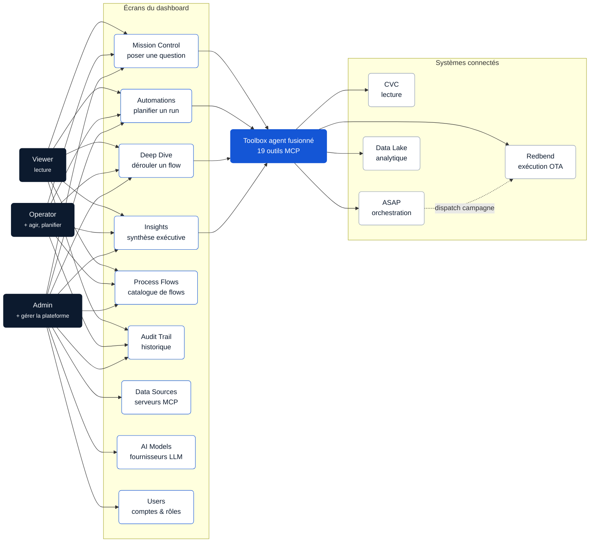

**Ce que montre le schéma —** Data Sources, AI Models et Users sont **exclusifs à l'admin** (ils
touchent des secrets ou la gestion des comptes) ; les six autres écrans sont ouverts à tous les rôles
authentifiés, avec des actions d'écriture réservées aux opérateurs+. Quatre écrans (Mission Control,
Automations, Deep Dive, Insights) passent tous par le même toolbox de 19 outils — aucun d'eux n'a sa
propre logique d'accès aux systèmes.

| Rôle | Accès |
| --- | --- |
| **Viewer** | Lecture seule sur les 6 écrans opérationnels. Ne peut ni écrire de configuration, ni gérer de comptes. |
| **Operator** | + chat, exécuter/planifier l'agent, gérer les process flows, lire l'audit trail. |
| **Admin** | + gérer les serveurs MCP, les fournisseurs LLM (et leurs clés), les comptes utilisateurs. |

---

## Schéma d'architecture

La même plateforme, vue cette fois par ses composants techniques réels : le frontend React est un
projet séparé qui ne parle au backend que par REST ; le backend est la seule pièce qui connaît
Postgres, le chiffrement et les serveurs MCP.

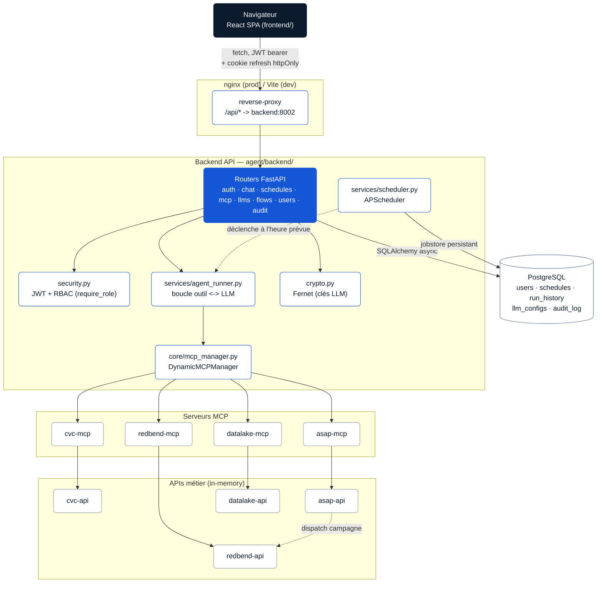

**Découplage —** le frontend ne contient *aucune* logique métier : il appelle des routes REST et
affiche le résultat. Le backend est le seul composant qui parle à Postgres, déchiffre une clé LLM, ou
ouvre une session MCP. Le scheduler tourne dans le *même* process que l'API (une seule boucle asyncio)
mais persiste ses jobs dans Postgres, donc un redémarrage du backend ne perd aucune automatisation.

| Composant | Port | Rôle |
| --- | --- | --- |
| `frontend` | 3000 → 80 | SPA React, servie par nginx |
| `backend` | 8002 | API FastAPI (auth, RBAC, scheduler) |
| `postgres` | 5432 | État persisté (users, schedules, run_history, audit_log…) |
| `*-mcp` | 8011–8014 | Adaptateurs MCP (Streamable HTTP) |
| `*-api` | 8021–8024 | APIs métier simulées (CVC/ASAP/Redbend/Data Lake) |

---

## 1 — Authentification

Chaque autre séquence de ce document suppose qu'un token d'accès existe déjà en mémoire côté navigateur — voici comment il y arrive.

**Rôles :** Public (nécessite un compte existant)

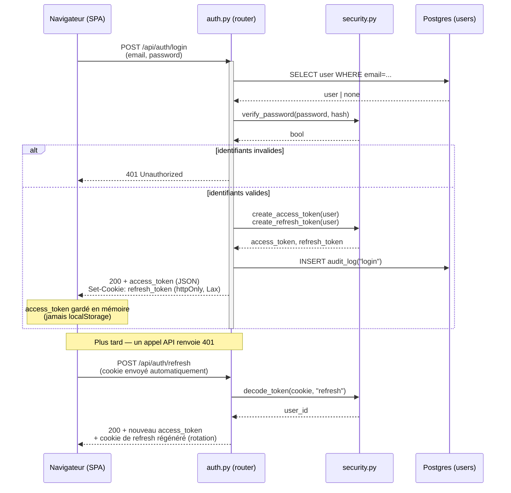

**Ce qui compte —** le mot de passe est comparé via Argon2id, jamais en clair ; le refresh token n'est *jamais* lisible en JavaScript (cookie httpOnly) ; l'access token vit 15 minutes et n'existe qu'en mémoire côté navigateur — un rechargement de page force un `/refresh` silencieux.

---

## 2 — Mission Control — poser une question

Le chat interactif. Une session garde son historique de conversation tant que le même LLM/modèle reste sélectionné.

**Rôles :** Viewer (non), Operator, Admin

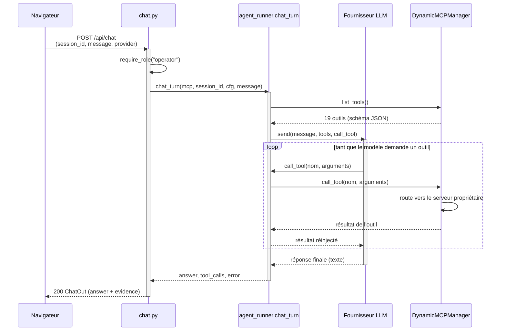

**Ce qui compte —** le `session_id` envoyé par le navigateur est préfixé côté serveur par l'id de l'utilisateur (`f"{user.id}:{session_id}"`) — un utilisateur ne peut pas deviner l'id d'un autre pour lire sa conversation. Le panneau « Evidence » de l'écran affiche exactement `tool_calls`, rien de plus.

---

## 3 — Automations — planifier, puis exécuter

Deux moments distincts : la création (immédiate, à l'écran) et le déclenchement (asynchrone, potentiellement des jours plus tard — survit à un redémarrage du backend).

**Rôles :** Viewer (lecture), Operator, Admin

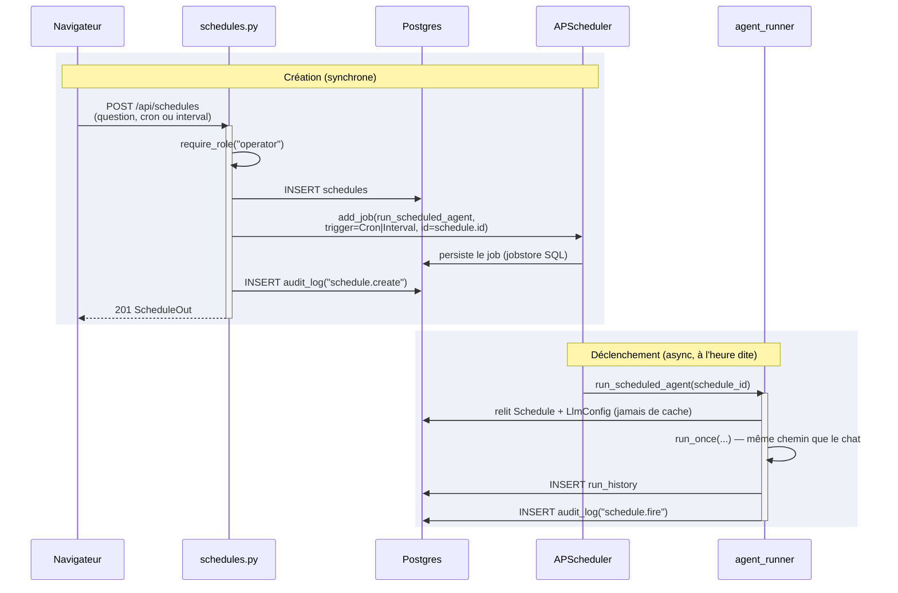

**Ce qui compte —** le job APScheduler est stocké dans Postgres, pas en mémoire process : un redémarrage du backend le recharge automatiquement. Chaque déclenchement relit la config depuis la base (pas de closure figée), donc éditer le LLM par défaut change le comportement du prochain run sans recréer le schedule.

---

## 4 — Deep Dive — dérouler un process flow

Aucun LLM ici : chaque étape appelle un outil MCP directement, et capture une valeur (VIN, id de campagne) réutilisée par l'étape suivante.

**Rôles :** Viewer, Operator, Admin

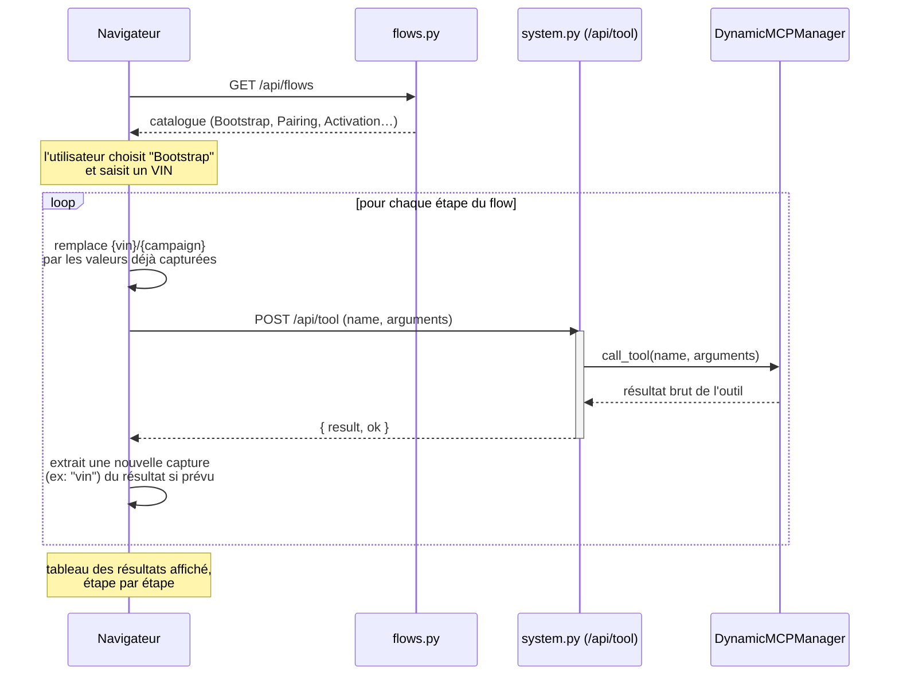

**Ce qui compte —** une étape sans sa capture requise (ex. pas de dérive trouvée → pas de `campaign`) est marquée *skipped* plutôt que d'échouer — c'est le `skip_note` défini dans le flow lui-même qui l'explique.

---

## 5 — Insights — KPIs et synthèse exécutive

Deux actions bien différentes sur le même écran : charger des chiffres bruts (aucun LLM) et générer une synthèse en langage naturel (via l'agent).

**Rôles :** Viewer, Operator, Admin

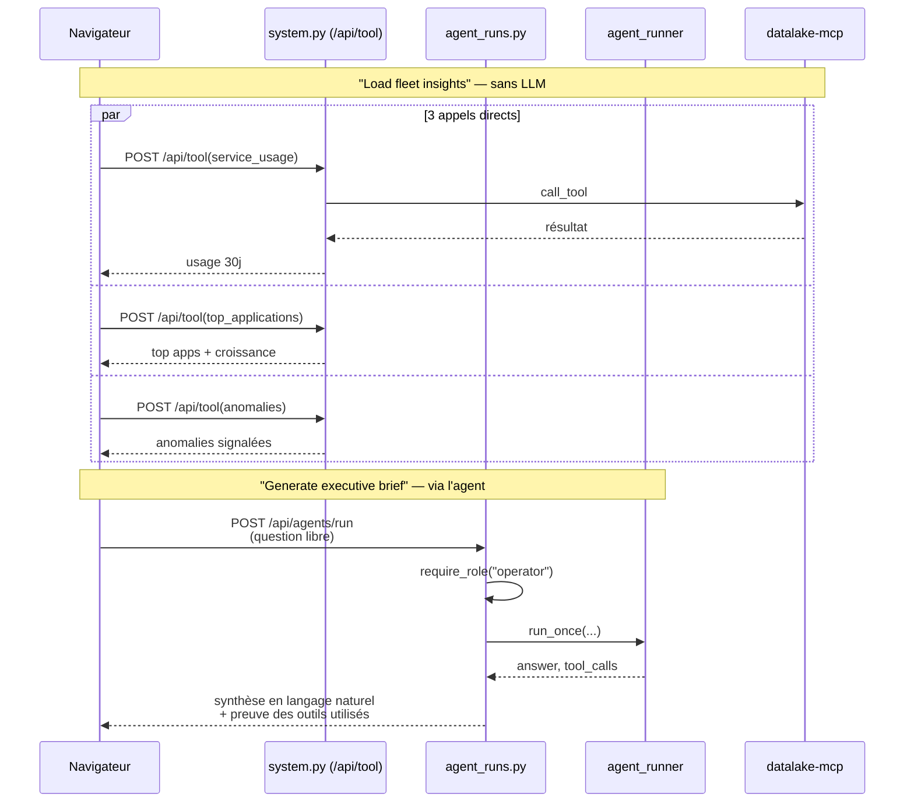

**Ce qui compte —** les KPIs bruts ne coûtent ni tour de LLM ni délai — ils passent par le même endpoint générique que Deep Dive. Seule la synthèse exécutive engage un modèle, et est donc aussi enregistrée dans `run_history`.

---

## 6 — Data Sources — connecter un serveur MCP

Réservé à l'admin : une URL de serveur MCP est une cible réseau sortante — l'ouvrir à tout rôle serait une surface SSRF.

**Rôles :** Admin uniquement

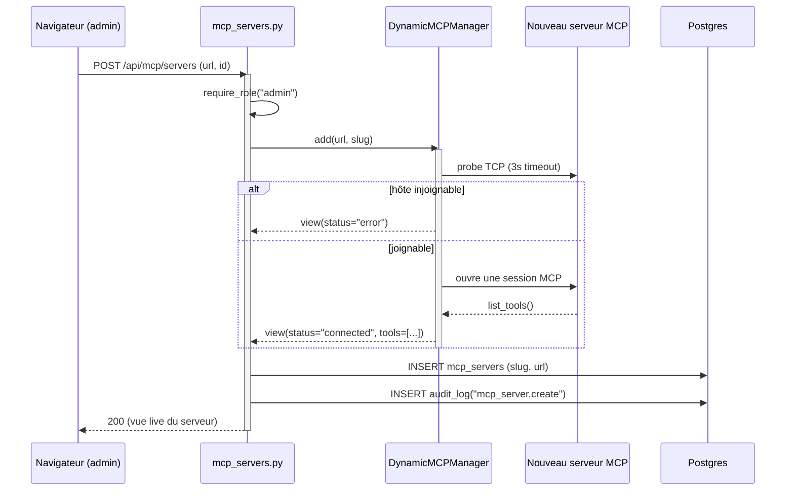

**Ce qui compte —** un serveur qui répond en erreur n'est pas rejeté : il est *enregistré avec `status="error"`*, visible dans la liste, pour diagnostiquer sans perdre la configuration. Les outils du nouveau serveur rejoignent le toolbox fusionné immédiatement, sans redémarrer le backend.

---

## 7 — AI Models — enregistrer un fournisseur LLM

La lecture (nom, type, modèle) est ouverte à tous ; seule l'écriture — qui touche une clé API — est réservée à l'admin.

**Rôles :** Viewer/Operator (lecture), Admin (écriture)

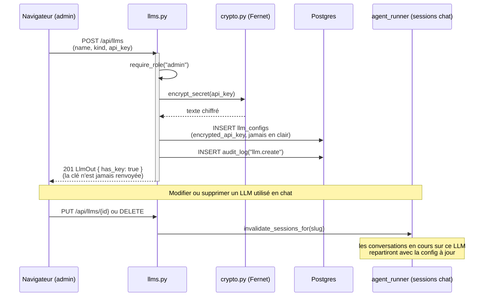

**Ce qui compte —** la clé API ne traverse le réseau qu'à la création/mise à jour ; toute lecture ultérieure (même par un admin) ne renvoie que `has_key: true/false`. Supprimer le dernier LLM restant est bloqué (l'agent doit toujours avoir un fournisseur par défaut).

---

## 8 — Process Flows — gérer le catalogue Deep Dive

CRUD classique sur des définitions déclaratives, plus une action de réinitialisation qui restaure les 5 flows d'origine.

**Rôles :** Viewer (lecture), Operator, Admin (écriture)

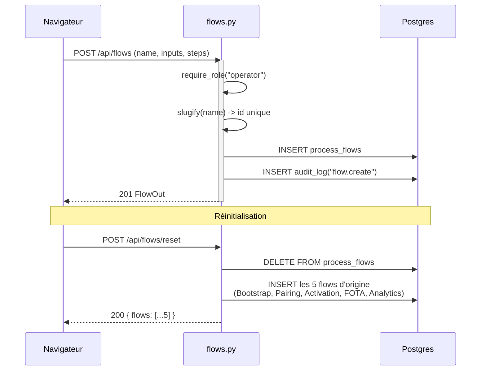

**Ce qui compte —** les flows créés par un opérateur et les 5 flows d'origine (`is_builtin=true`) vivent dans la même table — le reset écrase tout, y compris les flows personnalisés, ce que l'écran signale avant de confirmer.

---

## 9 — Audit Trail — consulter l'historique

Le seul écran purement passif : rien n'y est jamais écrit directement — il agrège ce que les neuf autres ont déjà produit.

**Rôles :** Viewer, Operator, Admin

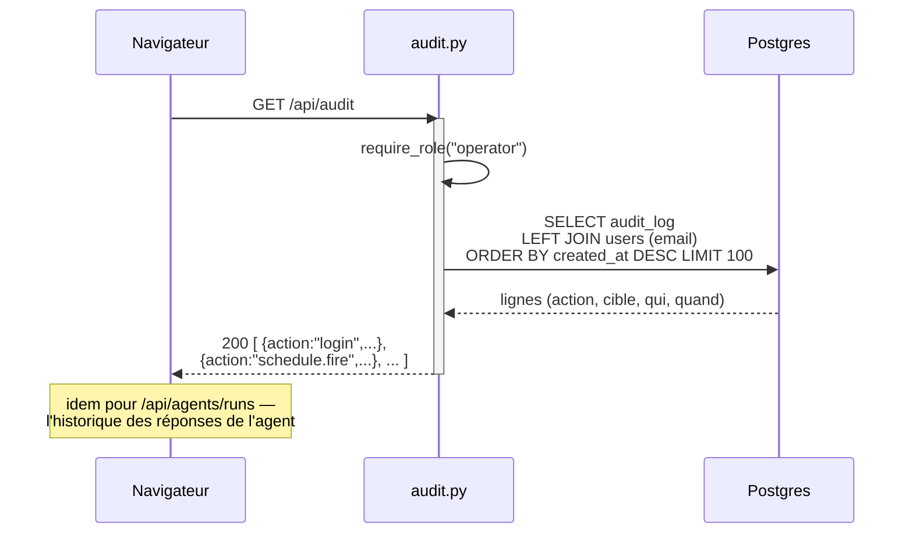

**Ce qui compte —** chacune des neuf autres séquences de ce document écrit au moins une ligne ici (`login`, `schedule.create`, `llm.delete`, `mcp_server.create`…) — cet écran est la trace de tout ce que ce document décrit ailleurs.

---

## 10 — Users — gérer les comptes et les rôles

Réservé à l'admin, avec deux garde-fous explicites pour éviter qu'un admin ne se verrouille lui-même hors de son propre compte.

**Rôles :** Admin uniquement

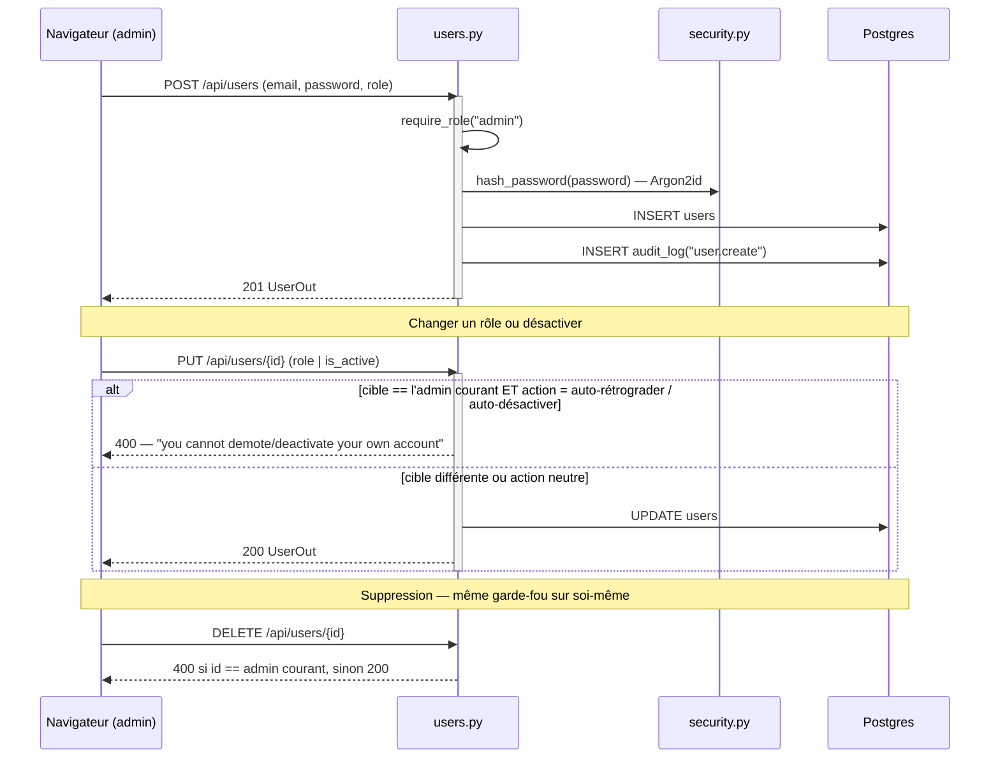

**Ce qui compte —** les deux garde-fous (auto-rétrogradation et auto-suppression) empêchent qu'un unique admin ne se retrouve accidentellement sans accès admin — un risque réel dès qu'il n'y a qu'un seul compte de ce rôle.

---
